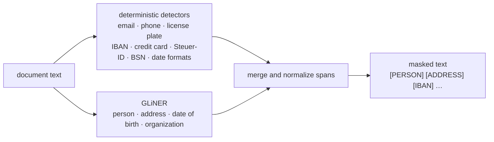
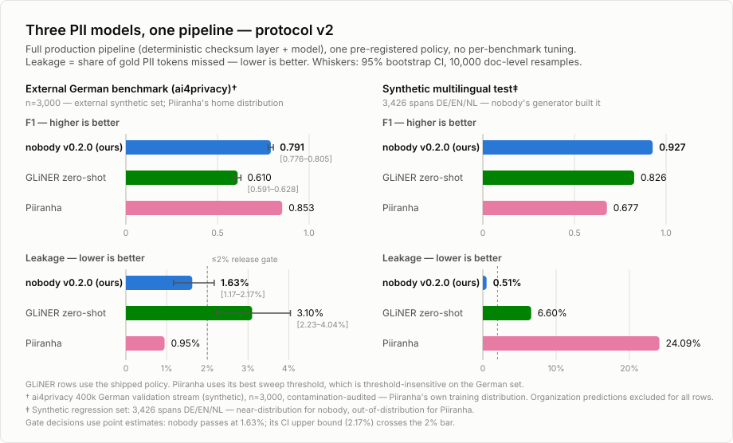

# nobody

**German-first PII redaction with a leakage budget.**

[](LICENSE)
[](requirements.txt)
[](https://github.com/urchade/GLiNER)
[](tests/)
[](https://huggingface.co/naeyn/nobody-pii-de)
[](https://huggingface.co/datasets/naeyn/nobody-pii-synth-de)

`nobody` detects and masks personally identifiable information in German,
English, and Dutch business documents. It combines deterministic validation
for structured identifiers with GLiNER for context-dependent entities. The
default policy favors recall: a leaked identifier is usually more costly than
an over-redacted phrase.

## Quickstart

```bash
python3 -m venv .venv
source .venv/bin/activate
pip install -r requirements.txt

echo "Anruf von Herrn Yilmaz, IBAN DE89 3704 0044 0532 0130 00" | \
  python redact.py --model naeyn/nobody-pii-de
```

You can also pass text directly:

```bash
python redact.py \
  --model naeyn/nobody-pii-de \
  --text "Kontakt: anna@example.de"
```

Example output:

```text
Kontakt: [EMAIL]
```

`--threshold` replaces the default per-label policy with one global model
threshold. Deterministic detectors are unaffected.

## How it works



Checksummed formats are validated before masking:

- IBAN: mod-97
- Credit cards: Luhn
- German tax IDs: ISO 7064
- Dutch BSNs: 11-test

Email, phone, license-plate, and date patterns cover common punctuation,
spacing, Unicode, and export/OCR variants. Model predictions handle names,
addresses, birth dates, and organizations. Overlapping spans are merged with
structured detections taking precedence where boundaries are identical.

## Results

Protocol v2 uses one production policy across all rows. Leakage is the share
of gold PII tokens missed; lower is better.

<picture>
  <source media="(prefers-color-scheme: dark)" srcset="assets/benchmark-dark.svg">
  
</picture>

**Real German documents** — 3,000-document validation stream, with 95%
document-level bootstrap confidence intervals:

| model | F1 | leakage |
|---|---:|---:|
| **nobody v0.2.0** | **0.791** [0.776–0.805] | **1.63%** [1.17–2.17] |
| Piiranha | 0.853 | 0.95% |
| `gliner_multi_pii-v1` zero-shot | 0.610 [0.591–0.628] | 3.10% [2.23–4.04] |

**Synthetic multilingual regression set** — 3,426 spans across German,
English, and Dutch:

| model | F1 | leakage |
|---|---:|---:|
| **nobody v0.2.0** | **0.927** | **0.51%** |
| `gliner_multi_pii-v1` zero-shot | 0.826 | 6.60% |
| Piiranha | 0.677 | 24.09% |

Piiranha is strongest on the German benchmark drawn from its own training-data
distribution and is licensed CC-BY-NC-ND. The synthetic set is close to
`nobody`'s training distribution and should be read as regression evidence,
not an independent real-world benchmark. Gate decisions use point estimates;
the German leakage interval still crosses 2% at its upper bound.
The GLiNER synthetic row was recomputed with the shipped production policy; no synthetic confidence interval is reported for this comparison.

Published artifacts:

- [Model card and weights](https://huggingface.co/naeyn/nobody-pii-de)
- [Synthetic training and regression dataset](https://huggingface.co/datasets/naeyn/nobody-pii-synth-de)

## Repository layout

| path | purpose |
|---|---|
| `redact.py` | inference CLI and deterministic detection pipeline |
| `tests/test_redact.py` | public behavior and regression tests |
| `assets/` | benchmark figures |
| `NOTICE` | third-party data and model attribution |

Model weights and datasets are distributed separately and are not stored in
Git. Training prompts, experiment journals, raw evaluations, publishing notes,
and temporary artifacts are intentionally excluded from this public source
repository.

## Known limitations

- **Address is the weakest class:** F1 0.550 and 15.85% leakage on the German
  benchmark. Bare house numbers and context-free street names remain hard.
- **Birth-date precision is intentionally low:** deterministic date matching
  trades precision for recall and can mask non-birth dates.
- Benchmark scores are proxies. Measure the pipeline on annotated samples from
  your own document distribution before deployment.
- Masking is pseudonymization, not necessarily anonymization. Context can still
  permit re-identification.

## Production guidance

1. Annotate a representative sample of your documents and measure both entity
   quality and token leakage.
2. Review address-heavy documents manually or add domain-specific detectors.
3. Record model version, thresholds, detected spans, and policy configuration
   for auditability.
4. Treat original documents and redaction logs as sensitive data.

## License and acknowledgements

Apache-2.0. Built on [GLiNER](https://github.com/urchade/GLiNER) and
[`urchade/gliner_multi_pii-v1`](https://huggingface.co/urchade/gliner_multi_pii-v1)
(Apache-2.0).

Part of the released model's training mix comes from
[`ai4privacy/pii-masking-openpii-1m`](https://huggingface.co/datasets/ai4privacy/pii-masking-openpii-1m)
(CC-BY-4.0; attribution: Ai4Privacy / Ai Suisse SA). Evaluation used the
German validation slice of
[`ai4privacy/pii-masking-400k`](https://huggingface.co/datasets/ai4privacy/pii-masking-400k)
without incorporating it into released weights. See [NOTICE](NOTICE) for the
full attribution statement.
