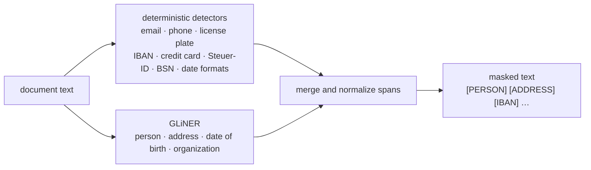
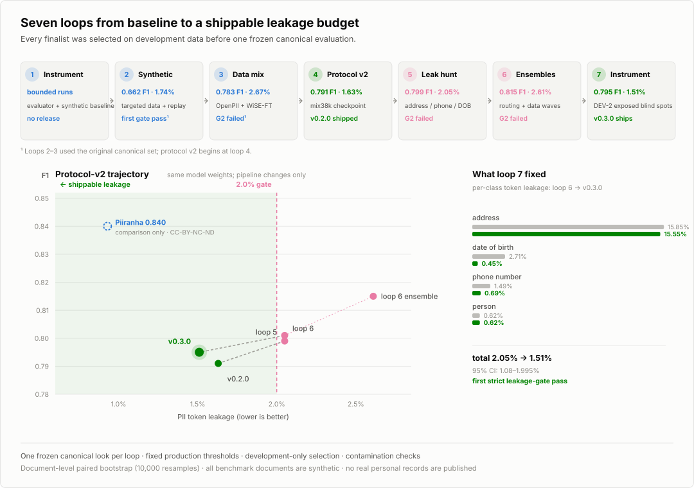

# nobody

**Local, German-first PII detection and redaction with a measured leakage budget.**

[](https://github.com/naeyn/nobody/releases/tag/v0.3.0)
[](LICENSE)
[](requirements.txt)
[](https://github.com/urchade/GLiNER)
[](tests/)
[](https://huggingface.co/naeyn/nobody-pii-de)
[](https://huggingface.co/datasets/naeyn/nobody-pii-synth-de)

`nobody` detects and masks personally identifiable information in German,
English, and Dutch business text. It runs locally and combines deterministic,
checksum-aware detectors for structured identifiers with GLiNER for names,
addresses, dates of birth, and organizations. The default policy favors recall:
a leaked identifier is usually more costly than an over-redacted phrase.

Useful starting points include document intake, support exports, CRM cleanup,
archive migration, and privacy review. It is not an anonymization or legal-
compliance guarantee; validate it on representative documents before production
use.

## Quickstart

```bash
python3 -m venv .venv
source .venv/bin/activate
pip install -r requirements.txt

echo "Anruf von Herrn Yilmaz, IBAN DE89 3704 0044 0532 0130 00" | \
  python redact.py --model naeyn/nobody-pii-de
```

You can also pass text directly:

```bash
python redact.py \
  --model naeyn/nobody-pii-de \
  --text "Kontakt: anna@example.de"
```

Example output:

```text
Kontakt: [EMAIL]
```

`--threshold` replaces the default per-label model policy with one global
threshold. Deterministic detectors are unaffected.

## How it works



Checksummed formats are validated before masking:

- IBAN: mod-97
- Credit cards: Luhn
- German tax IDs: ISO 7064
- Dutch BSNs: 11-test

Email, phone, license-plate, and date patterns cover common punctuation,
spacing, Unicode, HTML-entity, and export/OCR variants. Model predictions handle
context-dependent entities. Structured detections take precedence at identical
boundaries; conservative post-processing trims titles, excludes network and
placeholder addresses, and merges adjacent postal-address fragments.

## Results

Protocol v2 uses one released policy across every row. **Leakage** is the share
of gold PII tokens missed; lower is better. F1 uses exact token-span matching.

<picture>
  <source media="(prefers-color-scheme: dark)" srcset="assets/loops-dark.svg">
  
</picture>

### External German benchmark

3,000 documents from the German validation stream of
[`ai4privacy/pii-masking-400k`](https://huggingface.co/datasets/ai4privacy/pii-masking-400k),
synthetic and out-of-distribution for `nobody`. Intervals are 95% document-level
bootstrap intervals with 10,000 resamples.

| model | F1 | token leakage |
|---|---:|---:|
| **nobody v0.3.0** | **0.795** [0.780–0.810] | **1.51%** [1.08%–1.995%] |
| Piiranha-v1, matched pipeline | 0.840 | 0.93% |
| `gliner_multi_pii-v1` zero-shot | 0.635 | 2.26% |

The paired comparison against Piiranha is unambiguous: ΔF1 **−0.0452**
[−0.0586, −0.0318] and Δleakage **+0.58 percentage points** [+0.11, +1.09].
`nobody` does **not** beat Piiranha on Piiranha's home release. Piiranha is a
research comparator licensed CC-BY-NC-ND, not a redistributable dependency.

Per-label `nobody` results:

| label | precision | recall | F1 | leakage |
|---|---:|---:|---:|---:|
| person | 0.795 | 0.976 | 0.876 | 0.62% |
| address | 0.481 | 0.687 | 0.565 | 15.55% |
| email | 0.987 | 0.987 | 0.987 | 0.00% |
| phone number | 0.901 | 0.986 | 0.942 | 0.69% |
| date of birth | 0.305 | 0.993 | 0.466 | 0.45% |

### Synthetic multilingual regression set

The held-out companion test split contains 3,426 spans across German, English,
and Dutch:

| model | F1 | token leakage |
|---|---:|---:|
| **nobody v0.3.0** | **0.927** | **0.51%** |
| `gliner_multi_pii-v1` zero-shot | 0.826 | 6.60% |
| Piiranha-v1 | 0.677 | 24.09% |

This set is close to `nobody`'s generated training distribution. Read it as a
regression check, not independent evidence of real-world generalization.

### Cross-release sanity check

A second 3,000-document benchmark from the permissively licensed OpenPII-1M
German validation release reverses the ranking:

| benchmark | nobody | Piiranha | paired ΔF1 |
|---|---:|---:|---:|
| 400k validation, Piiranha's release | 0.795 | **0.840** | −0.045 [−0.059, −0.032] |
| OpenPII-1M validation, `nobody`'s release | **0.982** | 0.915 | +0.067 [+0.059, +0.074] |

This is **not** evidence that either system universally wins. Each model leads
on its home generator; OpenPII-1M has no date-of-birth class; and address gold
conventions differ sharply. The ≈0.105 F1 interaction shows that exact-span PII
benchmarks measure generator and annotation conventions as well as detection
capability.

## Scientific methodology

The release protocol was designed to prevent benchmark tuning:

1. **Development-only selection.** Candidate data, checkpoints, rules, and fixed
   per-label thresholds were selected on disjoint development streams.
2. **Frozen canonical look.** Each loop wrote its finalist and decision rule
   before one canonical evaluation. Failed candidates were reported as failures;
   canonical results were never used for another tweak inside that loop.
3. **Leakage-first gates.** Shipping required German F1 at least 0.05 above the
   zero-shot baseline, ≤2.00% leakage on both German and synthetic sets, and a
   minimum cross-set F1 of 0.55. Loop 7 additionally required the leakage CI's
   upper bound to stay below 2.00%; it passed at 1.995%, a thin 0.005pp margin.
4. **Paired inference.** Differences between systems and loop finalists use
   paired document-level bootstrap estimates, not overlapping marginal CIs.
5. **Contamination controls.** Exact-text and n-gram overlap checks excluded
   contaminated development candidates. The OpenPII-1M benchmark removed 590
   documents sharing a 12-gram with training; no exact duplicates remained.
6. **No sensitive publication.** All published benchmark and training sources
   are described by their publishers as synthetic. Raw benchmark documents,
   leak excerpts, local paths, credentials, and redaction logs are not included
   in this repository.

See [RESEARCH.md](RESEARCH.md) for the seven-loop record, accepted and rejected
hypotheses, paired statistics, and measurement caveats.

## What changed in v0.3.0

The model weights are byte-for-byte unchanged from v0.2.0. The improvement is in
the public inference policy:

- broader but still cue-gated German building-number fields;
- recall-first month/slash dates unless an explicit operational field excludes
  them;
- spaced and punctuated phone formats plus German contact lead-ins;
- guards against phone spans inside IBAN-like, credit-card, and long identifiers;
- title trimming and non-postal address rejection;
- adjacent address-component normalization.

Against the loop-6 champion, these changes traded **−0.0064 F1**
[−0.0097, −0.0034] for **−0.54pp leakage** [−0.96, −0.20]. Both changes are
statistically significant. This deliberate gate-first trade produced the first
configuration in three loops to pass every release gate.

## Repository layout

| path | purpose |
|---|---|
| `redact.py` | inference CLI and deterministic detection pipeline |
| `tests/test_redact.py` | public behavior and regression tests |
| `RESEARCH.md` | methodology, seven-loop record, and statistical caveats |
| `CHANGELOG.md` | public release history |
| `assets/` | generated light/dark research figures |
| `NOTICE` | third-party data and model attribution |

Model weights and datasets are distributed separately and are not stored in
Git. Raw evaluations, benchmark records, private orchestration, and temporary
artifacts are intentionally excluded from this public source repository.

## Known limitations

- **Address remains the weakest class:** F1 0.565 and 15.55% token leakage on
  the external German benchmark. Bare house numbers and context-free street or
  place names remain difficult.
- **Birth-date precision is intentionally low:** recall 0.993, precision 0.305.
  Recall-first numeric-date matching can mask ordinary dates.
- **The leakage gate is narrowly cleared:** its bootstrap upper bound is 1.995%,
  only 0.005pp below the stricter 2.00% bar.
- **All reported benchmarks are synthetic.** No result establishes performance
  on scanned originals, handwriting, unseen OCR systems, or another company's
  document distribution.
- Masking is pseudonymization, not necessarily anonymization. Surrounding
  context can still permit re-identification.

## Production guidance

1. Annotate a representative sample of your own documents; measure exact-span
   F1 and token leakage separately.
2. Review address-heavy and OCR-heavy documents manually or add domain-specific
   detectors.
3. Record model revision, thresholds, policy configuration, and detected spans
   for auditability.
4. Keep original documents and redaction logs inside the same security boundary
   as the source data.
5. Do not send sensitive documents to third-party services without an
   appropriate processing agreement and security review.

## License and acknowledgements

Apache-2.0. Built on [GLiNER](https://github.com/urchade/GLiNER) and
[`urchade/gliner_multi_pii-v1`](https://huggingface.co/urchade/gliner_multi_pii-v1)
(Apache-2.0).

Part of the released model's training mix comes from
[`ai4privacy/pii-masking-openpii-1m`](https://huggingface.co/datasets/ai4privacy/pii-masking-openpii-1m)
(CC-BY-4.0; attribution: Ai4Privacy / Ai Suisse SA). Evaluation used the German
validation slice of
[`ai4privacy/pii-masking-400k`](https://huggingface.co/datasets/ai4privacy/pii-masking-400k)
without incorporating it into released weights or redistributing its records.
See [NOTICE](NOTICE) for the full attribution statement.
